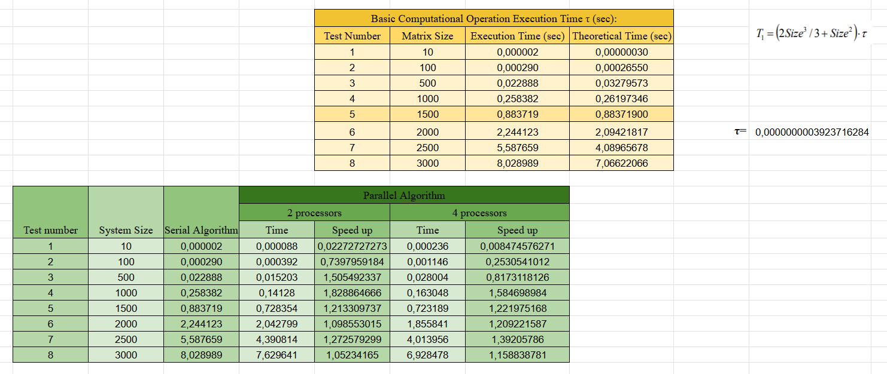

# Lab 03 — Parallel Methods of Solving the Linear Equation Systems

## Мета роботи:
Метою лабораторної роботи є ознайомлення з принципами паралельної реалізації методу Гауса для розв’язання систем лінійних алгебраїчних рівнянь за допомогою бібліотеки MPI (Message Passing Interface).
У ході роботи було реалізовано послідовний алгоритм прямого ходу та зворотного ходу Гауса; паралельний алгоритм з частковим вибором головного елемента;

---

## Опис реалізації
### Послідовний алгоритм
Послідовна версія програми виконує стандартний метод Гауса.

#### Прямий хід
- ітеративне виключення змінних із нижчих рядків;
- пошук опорного елемента у стовпці (*partial pivoting*);
- нормування рядків та занулення елементів під діагоналлю.

#### Зворотний хід
- обчислення значень невідомих зверху вниз;
- використання вже знайдених елементів розв’язку.

---

### Паралельний алгоритм Гауса

Паралельна версія використовує:
- горизонтальний розподіл рядків матриці між процесами;
- глобальний пошук опорного елемента за допомогою MPI_Allreduce;
- широкомовну передачу опорного рядка (MPI_Bcast);
- незалежні виключення для своїх локальних рядків;
- паралельний зворотний хід із поширенням знайдених значень по всіх процесах.

### Використані MPI-механізми
- **MPI_Scatterv** — нерівномірний розподіл рядків матриці між процесами.  
- **MPI_Allreduce (MPI_MAXLOC)** — глобальний пошук опорного елемента та процесу-власника.  
- **MPI_Bcast** — розсилка опорного рядка та значень у зворотному ході.  
- **MPI_Gatherv** — збір частин результатного вектора різного розміру.  
- **MPI_Barrier** — синхронізація під час тестування.  
- **MPI_COMM_WORLD** — основний комунікатор для всіх операцій.

---

## Результати експериментів

---

## Аналіз результатів

- Паралельний алгоритм Гауса з MPI **краще масштабується на 2 процеси**, ніж на 4.
- Ефективність різко падає при великих *p*, тому що:
  - прямий хід вимагає глобального пошуку опорного елемента на кожній ітерації (O(n) викликів `MPI_Allreduce`);
  - на кожному кроці також виконується `MPI_Bcast`, що має вартість O(p).
- Метод добре підходить для **помірних розмірів матриць**, але складно масштабується до десятків процесів.
